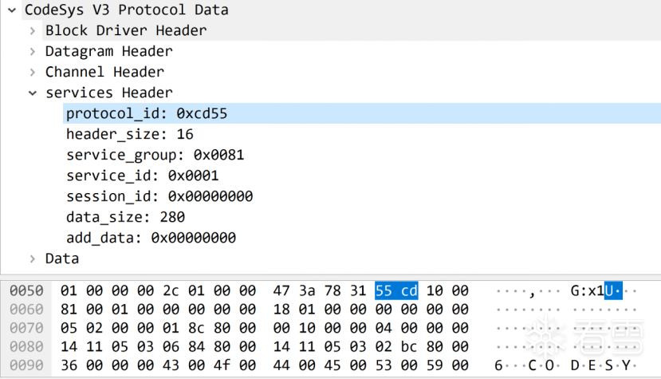

# Codesys协议分析

CodeSys属于私有协议，官方从未披露其报文格式和实现细节。要挖掘学习格式，需要研究人员从逆向工程进行分析

## 协议格式

### V2

CodeSys V2版本的协议相对简单，如下图所示。报文头是以“\xbb\xbb”打头，紧接着就是长度字段，后面接着功能码，图中的功能码为92，最后就是数据部分，从结构上来说，V2的协议相对简单。

### V3

V3 与V2的协议完全不同，该协议架构如下图所示，该协议栈分为四层：
1.块驱动层——Block Driver layer
2.数据报层——Datagram layer
3.通道层——Channel layer
4.服务层——Services layer

#### 块驱动层

块驱动层的组件的主要任务是创建通过物理或软件接口进行通信的能力。任何块驱动程序组件都是一个“输入点”，用于接收数据包和传输

数据包的点

#### 数据包层

该层的主要目的是路由数据包，检测 CODESYS 网络中的节点，并将数据传输到下一层。

简单介绍上面关键字段的含义：
**Magic 字段：**
通过 CODESYS协议生成的数据包的魔数。该字段的大小为一个字节。
**Hop count 字段：**
表示在网络上接收到的数据包所经过的CodeSys节点数。每当一个 CODESYS 网络节点收到一个数据包并将其重定向到另一个 CODESYS 网络节点时，它就会递减hop_count的值。如果一个节点收到了一个数据包但不是它的最终接收者并且hop_count字段的值等于 0，则节点将丢弃此数据包。本质上，该字段让 CODESYS 节点的网络免于无休止地转发数据包。
**packet_info字段：**
表示数据包相关设置。
**priority字段：**
指定处理数据包的优先级。以下数值用于指定优先级：0 – 低，1 – 正常，2 – 高，3 – 紧急
**length_data_block字段：**
表示接收者可以接受的最大数据大小。
**Service id 字段：**
服务ID，指示特定服务器必须处理接收到的数据。

#### 通道层

通道是 CODESYS 网络节点之间的一种通信机制，它保证通信的同步、传输数据完整性的验证、消息传递的通知以及大量数据的传输。

**Packet_type字段：**
BLK（0x1）包类型，表示数据传输。
**flags字段：**
BLK数据包类型的数据包标志。
**channel id 字段：**
用于数据传输的通道 ID。
**Blk_id 字段：**
当前 BLK 消息的 ID。此 ID 每次由通过信道发起通信开始的一方递增。
**Ack_id字段：**
最后一条 ACK 消息的 ID。该 ID 每次都由响应方更改。在应用层接收到最后一个数据传输到服务的数据包后，响应端将该ID进行更改。
**Remaining_data_size 字段：**
remaining_data 所包含的预期数据的大小。
**Checksum 字段：**
该字段是对remaining_data中包含的数据进行校验，CRC32算法用于计算校验和。

#### 服务层

该层的主要任务是查询请求的服务并传输其操作设置。服务层的任务包括对在该层传输的数据进行编码、解码、加密和解密。

**protocol_id字段：**
使用的协议的ID。此ID指示哪个协议处理程序修改了数据以及应使用哪个协议将数据传输到服务。
**Header size 字段:**
protocol_header的大小。该字段的值不包含先前字段和当前字段的大小。
**Service group字段:**
被查询服务的ID。如果在ID中设置了最高有效位，则意味着该消息是来自服务的响应。
**Service ID 字段：**
命令的ID，这个ID决定了服务执行的功能。
**session_id 字段：**
会话的ID，包含接收到的会话或空会话的值。
**data size 字段：**
protocol_data字段中数据的大小。

## 授权流程

CodeSys 在新版V3通讯协议中已经默认开启授权机制，用户必须设置账号密码才可以进一步使用。在设置密码成功后，用户必须登录后才能对PLC进行控制管理以及编程组态等操作。但是具体的算法之前从未有人披露过，下面我将简单介绍其流程和相关算法。

### 密码哈希存储

新版CodeSys V3通讯协议账号相关信息默认存放于UserDatabase文件中，旧版本的CodeSys V3的密码是MD5加密的，新版做了改进，使用了scrypt算法来进行存放。该算法在CryptoDeriveKey中实现，如下所示：

UserDatabase文件内容如下，其中“admin”为用户名，后面接着的是密码哈希信息。

- “d819a24df7bdc985”指的是scrypt的盐salt。
- “02f6……5cfd” 指的是scrypt算出的密码哈希。
- “512，8，1”指的是scrypt的N,r,p参数。

使用scrypt原因主要为该算法不仅计算所需时间长，而且占用的内存也多，使得并行计算多个摘要异常困难，因此利用彩虹表进行暴力攻击更加困难。

当然即使算法设计的再健全，也挡不住用户使用弱口令。在最新版的组态软件并没有强制要求密码强度，使得用户也可以设置诸如“123456”等弱口令密码。这就导致安全意识不强的用户会将密码设置成弱口令。

可以通过编写py脚本将scrypt哈希信息转换为hashcat的格式，从而利用hashcat对哈希进行爆破

### 授权协议流程

客户端先通过CmpDevice的2号服务ID请求PLC获取公钥和challenge：

PLC将会随机生成一个密钥对和一个32字节的challenge，响应包将包含公钥和challenge。

公钥信息如下所示：

32 字节challenge信息如下：

客户端在接收以上信息后，使用CryptoAsymmetricEncrypt函数加密密码，该函数如下所示：

使用python描述password_info生成算法：

- RSA加密使用的是PKCS1_OAEP，其中的哈希算法为SHA256。

- XOR算法是简单的逐位异或算法。

  最后，客户端再次通过CmpDevice的2号服务ID下发到PLC中：

如果密码正确的话将会返回app key，每次进行操作都需要携带该授权key。

**风险分析**

存在中间人攻击

## RCE

密码保护是保护CodeSys PLC的重要防线，一旦攻击者突破这层防线，就可以利用注入代码的方法插入任意shellcode执行RCE。这是由于CodeSys为了实现可编程功能，会将用户编写的代码统一编译成机器码，并且由RunTime调度执行，执行的过程没有在VM或者sandbox中，这就导致攻击者可以插入任意的机器码（例如LINUX平台上的反弹shell）来完全接管PLC。

# 参考资料

+ [[原创\][工控安全]CodeSys V3 协议及授权机制分析-智能设备-看雪-安全社区|安全招聘|kanxue.com](https://bbs.kanxue.com/thread-276027.htm)
+ [Security research: CODESYS Runtime, a PLC control framework. Part 2 | Kaspersky ICS CERT](https://ics-cert.kaspersky.com/publications/reports/2019/09/18/security-research-codesys-runtime-a-plc-control-framework-part-2/)