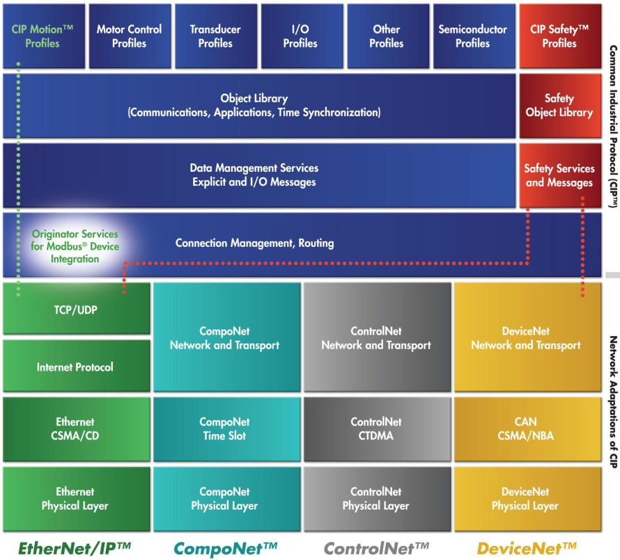
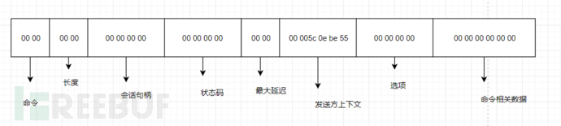

# Ethernet/ip 协议

## 介绍

**EtherNet/IP**是由[洛克威尔自动化公司](https://zh.wikipedia.org/wiki/洛克威爾自動化公司)开发的[工业以太网](https://zh.wikipedia.org/wiki/工業乙太網)通讯协定，由[ODVA](https://zh.wikipedia.org/w/index.php?title=ODVA&action=edit&redlink=1)（ODVA）管理，可应用在程序控制及其他[自动化](https://zh.wikipedia.org/wiki/自動化)的应用中，是[通用工业协定](https://zh.wikipedia.org/wiki/通用工業協定)（CIP）中的一部分。

EtherNet/IP名称中的IP是“Industrial Protocol”（工业协议）的简称，和[网际协议](https://zh.wikipedia.org/wiki/網際協議)没有关系。

EtherNet/IP基于以太网和TCP/IP技术，其物理层和数据链路层使用以太网协议，网络层和传输层使用TCP/IP协议族中的协议，应用层使用CIP协议。EtherNet/IP允许工业设备在对时间要求比较苛刻的环境中交换应用程序信息。这些设备包括简单的I/O设备，如传感器/执行器，以及复杂的控制设备，如机器人、可编程逻辑控制器、焊工和过程控制器等。CIP（Common Industry Protocol）是一种端对端的面向对象协议，它规范了工业设备（传感器、执行器）和高级设备(控制器)之间的连接。CIP作为开放性应用层协议，独立于物理媒体和数据链路层的，目前被EtherNet/IP、CompoNet、ControlNet和DeviceNet四种网络共用。对于用户而言，所有CIP工业网络是无缝集成的“一种”网络。EtherNet/IP利用标准以太网和TCP/IP技术传输CIP通信数据包。应该注意的是EtherNet/IP不是以太网(IEEE 802.3)协议，它只是通过常规TCP/IP连接传输。



　EtherNet/IP通常通过TCP/UDP端口44818运行。此外，EtherNet/IP还使用UDP端口2222。使用不同端口的原因是EtherNet/IP实现了隐式和显示两种消息传递方式。显式消息被称为客户端/服务器消息，而隐式消息通常被称为I/O消息。

> 显示报文：用于在传输时不追求实时性，对时间要求不严格内容，比如程序的上传下载，设备配置信息等。
>
> 隐式报文：传输I/O数据。

## 格式



命令：两字节整数，要求与通用工业协议规范中某条特定指令相关，在CIP协议中，即使设备不认识这个命令是什么也必须接收，而且异常处理时必须确保连接不中断，这种设计很好的保证了协议的稳定性，降低了中断连接的风险。CIP协议本身有着实时性、确定性、可重复性、可靠性等特点。

长度：两字节整数，表示数据部分长度，不存在则为0，比如说请求数据包就不存在数据部分

会话句柄：由目标设备生成，返回至会话发起方，作为一种凭证，证明你可以和我进行对话，这个凭证在接下来的对话里还会用到。

状态码：反应了接收方对设备发送的命令的执行能力，0为成功执行，在请求数据包中永远为0，下面列出其他几种状态码。

```
0x0001无效或不支持的命令（这种命令异常处理时不中断运行）

0x0002接收方处理命令资源不足（这里我没找到相关资料描述，但根据CIP协议高稳定性原则推测应该会进行不中断运行等待资源足的时候进行执行）

0x0003数据格式不正确或数据不正确

0x0065接收到无效数据长度
```

最大延迟：由于工业以太网对实时性要求高，这里的内容是这个包经历的最大延迟。

发送方上下文：命令发送方会生成六个字节的值，接收方要原封不动的发回去，这个内容可以理解为回复的一种编号，发送方知道接收方收到了对应编号的报文，回复的是对相应报文的回复。

选项：始终为0，不为0的话包会被抛弃。

命令相关数据：这就和我们接受和发送的命令和自身情况有关了。

# 参考资料

+ [EtherNet/IP - 维基百科，自由的百科全书 (wikipedia.org)](https://zh.wikipedia.org/wiki/EtherNet/IP)
+ [工控安全EthernetIP协议分析 - FreeBuf网络安全行业门户](https://www.freebuf.com/articles/ics-articles/218674.html)
+ [EtherNet/IP CIP协议 - yuxi_o - 博客园 (cnblogs.com)](https://www.cnblogs.com/embedded-linux/p/12078664.html)

