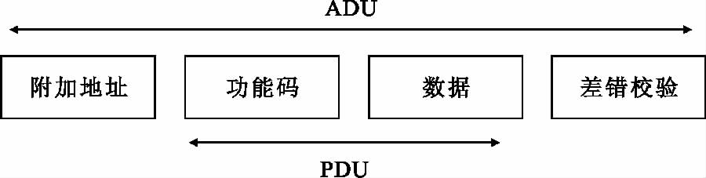
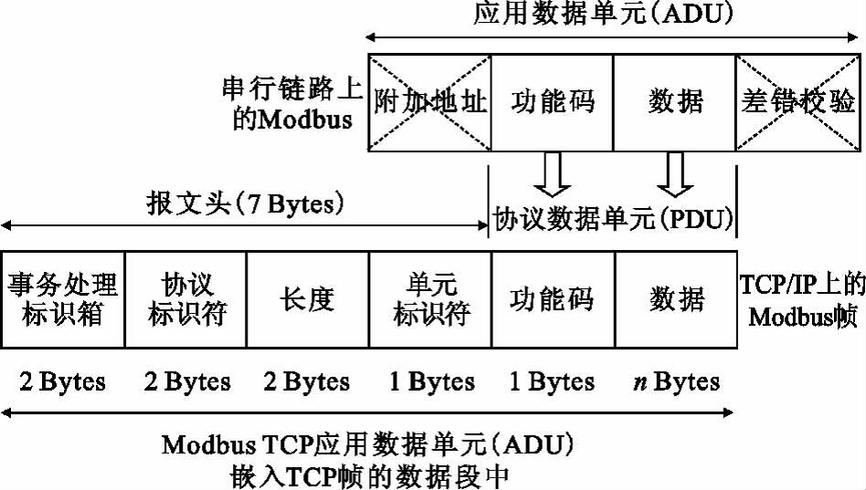
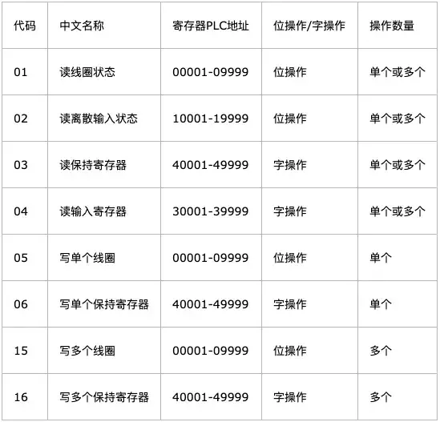

# Modbus 笔记

绝大部分参考[工控Modbus学习笔记（在FreeBuf原文上增改） (myfzy.top)](https://myfzy.top/2019/10/24/Modbus/#术语)

在此基础上有所删改

## 术语

**离散量输入**：主要用来读取单个位的数据，如IO的状态；

**线圈**：开关输出信号，主要用来写入单个位的数据，与离散量构成组成对位的操作；

**输入寄存器**：主要用来读取16位，也就是两个字节的数据；

**保持寄存器**：主要用来写入16位的数据。

**串口通信**：随着计算机系统的应用和微机网络的发展，通信功能越来越显得重要.这里所说的通信是指计算机与外界的信息交换.因此，通信既包括计算机与外部设备之间，也包括计算机和计算机之间的信息交换.由于串行通信是在一根传输线上一位一位的传送信息，所用的传输线少，并且可以借助现成的电话网进行信息传送，因此，特别适合于远距离传输.对于那些与计算机相距不远的人－机交换设备和串行存储的外部设备如终端、打印机、逻辑分析仪、磁盘等，采用串行方式交换数据也很普遍.在实时控制和管理方面，采用多台微机处理机组成分级分布控制系统中，各 CPU 之间的通信一般都是串行方式.所以串行接口是微机应用系统常用的接口。许多外设和计算机按串行方式进行通信，这里所说的串行方式，是指外设与接口电路之间的信息传送方式，实际上，CPU 与接口之间仍按并行方式工作.

**串口**：串口是计算机上一种非常通用设备通信的协议，不要与通用串行总线Universal Serial Bus（USB）混淆。大多数计算机包含两个基于RS232的串口。串口同时也是仪器仪表设备通用的通信协议；很多GPIB兼容的设备也带有RS-232口。同时，串口通信协议也可以用于获取远程采集设备的数据。

串口通信的概念非常简单，串口按位（bit）发送和接收字节。尽管比按字节（byte）的并行通信慢，但是串口可以在使用一根线发送数据的同时用另一根线接收数据。它很简单并且能够实现远距离通信。比如IEEE488定义并行通行状态时，规定设备线总常不得超过20米，并且任意两个设备间的长度不得超过2米；而对于串口而言，长度可达1200米。

典型地，串口用于ASCII码字符的传输。通信使用3根线完成：（1）地线，（2）发送，（3）接收。由于串口通信是异步的，端口能够在一根线上发送数据同时在另一根线上接收数据。其他线用于握手，但是不是必须的。**串口通信最重要的参数是波特率、数据位、停止位和奇偶校验**。对于两个进行通行的端口，这些参数必须匹配：

## 协议原理

Modbus使用Master slave(主从协议)进行通信，客户机作为主站，向服务器发送请求；服务器（从站）接到请求后，对请求进行分析并作出应答。其中使用的通信帧被称为**应用数据单元（Application Data Unit，ADU**），它包括通信地址段、功能代码段、数据段和校验段，如下图：

一般使用上，监控系统(HMI)都为Master，PLC、电表、仪表等都为Slave，HMI系统一直PollingSlave的各种relayandregister最新数值，然后做显示及各种逻辑计算及控制调整等处理。

其中，功能代码段和数据段组合称为**协议数据单元（Protocol Data Unit or Protocol Description Unit)，PDU）**。功能代码段占用一个字节，取值范围为1-255，其中128-255为保留值，用于异常消息应答报文。1-127为功能代码编号，其中65-72和100-110为用户自定义编码。

Modbus协议建立了主设备查询的格式：设备（或广播）地址、功能代码、所有要发送的数据、错误检测域。

从设备回应消息也由Modbus协议构成，包括：确认要行动的域、任何要返回的数据、和错误检测域。

***查询\***

数据段包含了从设备要执行功能的任何附加信息：从何寄存器开始读、要读的寄存器数量，错误检测域为从设备提供了一种验证消息内容是否正确的方法。

***回应\***

查询消息中的功能代码的回应。数据段包括了从设备收集的数据：像寄存器值或状态。如果有错误发生，功能代码将被修改以用于指出回应消息是错误的，同时数据段包含了描述此错误信息的代码。错误检测域允许主设备确认消息内容是否可用。

## modbus TCP协议简述

modbus TCP和modbus RTU基本相同，但是也存在一些区别

a.从机地址变得不再重要，多数情况下忽略。从某种意义上说从机地址被IP地址取代

b.CRC校验变得不再重要，甚至可以忽略。由于TCP数据包中已经存在校验，为了不重复造轮子，modbus TCP干脆取消了CRC校验。

TCP 模式是为了让Modbus 数据顺利在以太网上传输产生的，使用TCP502 端口。该协议物理层，数据链路层，网络层，传输层都是基于TCP 协议，只在应用层，将Modbus 协议修改后封装进去; 接收端将该TCP 数据包拆封后，重新获得原始Modbus 帧，然后按照Modbus 协议规范进行解析，并将返回的数据包重新封装进TCP 协议中，返回到发送端。与串行链路传输的数据格式不同，TCP 模式去除了附加地址和校验，增加了报文头，其具体格式如图所示。

在modbus TCP中包含一个MBAP头，该头包含以下几个部分

| 区域     | 长度  | 描述                              | 客户端     | 服务器               |
| -------- | ----- | --------------------------------- | ---------- | -------------------- |
| 传输标志 | 2字节 | MODBUS 请求和响应传输过程中序列号 | 客户端生成 | 应答时复制该值       |
| 协议标志 | 2字节 | Modbus协议默认为0                 | 客户端生成 | 应答时复制该值       |
| 长度     | 2字节 | 剩余部分的长度                    | 客户端生成 | 应答时由服务器端生成 |
| 单元标志 | 1字节 | 从机标志（从机地址）              | 客户端生成 | 应答时复制该值       |

【注意】

> 【1】传输标志可理解为序列号，防止 MODBUS TCP通信错位，例如后发生的响应先到了主机，而早发生的响应后到主机
>
> 【2】单元标志可理解为从机地址，此时已经不再重要

### modbus tcp 和 TCP IP的关系

modbus TCP可以理解为发生在TCP上的应用层协议，既然是TCP协议那么一个完整的MODBUSTCP报文必然包括TCP首部，IP首部和Ethernet首部。

## 功能码作用

启动Modbus事务处理的客户机创建Modbus应用数据单元。功能码（PDU中的）向服务器指示将执行哪种操作。

用一个字节编码Modbus数据单元的功能码域。有效范围是十制制1-255（128-255为异常响应保留）。当从客户机向服务器发送报文时，功能码域通过服务器执行哪种操作。

从客户机向服务器发送的报文数据域包括附加信息，服务器使用这个信息执行功能码定义的操作。这个域还包括离散项目和寄存器地址、处理项目的数量以及域中的实际数据字节数。

在某种请求中，数据域可以是不存在的，在此情况下服务器不需要任何附加信息。功能码仅说明操作。

**功能码的类型**

功能码主要分为有效功能码、异常功能码和错误功能码。

如果在一个正确接收Modbus ADU中，不出现与请求Modbus功能有关的差错，那么服务器至客户机的响应数据会包含请求中的正常功能码。

如果出现与请求Modbus功能有关的差错，那么响应数据会包含一个异常码和错误码。

对于异常响应，服务器返回一个与客户机等同的码，设置该原始功能码的最高有效位为逻辑1，并加该异常码后增加错误码，以通知客户机异常原因。如下图：

**有效功能码**

有效功能码有二十几种，但是一般使用上都以1、2、3、4、5、6、15、16等八种最为常用，以及另外特殊使用的20、21两种，此为General Reference Register，绝大部份的Modbus设备并不会提供此Register。于PLC上主要的控制数据有下列四种型式。此八种功能码就是处理这些控制资料，详细说明如下各点：

**控制数据四种型式：**

DI：DigitalInput（数字输入，离散输入），一个地址一个数据位，用户只能读取它的状态，不能修改。以一个 bit表示 On/Off，用来记录控制信号的状态输入，例如：开关，接触点，马达运转，超限switch…等等。于PLC上被称为Input relay、input coil等。

DO：DigitalOutput（数字输出，线圈输出），一个地址一个数据位，用户可以置位、复位，可以回读状态。以一个 bit表示 On/Off，用来输出控制信号，以激活或停止马达，警铃，灯光…等等。于PLC上被称为Output relay、Output coil等。

AI：Analog Input（模拟输入，输入寄存器），一个地址16位数据，用户只能读，不能修改，，以16 bits integer表示一个数值，用来记录控制信号的数值输入，例如：温度、流量、料量、速度、转速、文件板开度、液位、重量…等等。于PLC上被称为Input register。

AO：AnalogOutput（模拟输出，保持寄存器），一个地址16位数据，用户可以写，也可以回读，以16 bits integer表示一个数值，用来输出控制信号的数值，例如：温度、流量、速度、转速、文件板开度、饲料量…等等设定值。于PLC上被称为Output register、Holding register。

## Modbus安全性分析

### Modbus 协议的固有问题

**( 1) 缺乏认证**

认证的目的是保证收到的信息来自合法的用户，未认证用户向设备发送控制命令不会被执行。在Modbus 协议通信过程中，没有任何认证方面的相关定义，攻击者只需要找到一个合法的地址就可以使用功能码就能建立一个Modbus 通信会话，从而扰乱整个或者部分控制过程。

**( 2) 缺乏授权**

授权是保证不同的特权操作需要由拥有不同权限的认证用户来完成，这样可大大降低误操作与内部攻击的概率。目前，Modbus 协议没有基于角色的访问控制机制，也没有对用户分类，没有对用户的权限进行划分，这会导致任意用户可以执行任意功能。

**( 3) 缺乏加密**

加密可以保证通信过程中双方的信息不被第三方非法获取。Modbus 协议通信过程中，地址和命令全部采用明文传输，因此数据可以很容易的被攻击者捕获和解析，为攻击者提供便利。

**( 4) 功能码滥用**

功能码是Modbus 协议中的一项重要内容，几乎所有的通信都包含功能码。目前，功能码滥用是导致Modbus 网络异常的一个主要因素。例如不合法报文长度，短周期的无用命令，不正确的报文长度，确认异常代码延迟等都有可能导致拒绝服务攻击。

### 协议实现产生的问题

虽然Modbus 协议获得了广泛的应用，但是在实现具体的工业控制系统时，开发者并不具备安全知识或者没有意识到安全问题。这样就导致了使用Modbus 协议的系统中可能存在各种各样的安全漏洞。

**( 1) 设计安全问题**

Modbus 系统开发者重点关注的是其功能实现问题，安全问题在设计时很少被注意到。设计安全是指设计时充分考虑安全性，解决Modbus 系统可能出现的各种异常和非法操作等问题。比如在通信过程中，某个节点被恶意控制后发出非法数据，就需要考虑这些数据的判别和处理问题。

**( 2) 缓冲区溢出漏洞**

缓冲区溢出是指在向缓冲区内填充数据时超过了缓冲区本身的容量导致溢出的数据覆盖在合法数据上，这是在软件开发中最常见也是非常危险的漏洞，可以导致系统崩溃，或者被攻击者利用来控制系统。Modbus 系统开发者大多不具备安全开发知识，这样就会产生很多的缓冲区溢出漏洞，一旦被恶意者利用会导致严重的后果。

**( 3) Modbus TCP 安全问题**

目前，Modbus 协议已经可以在通用计算机和通用操作系统上实现，运行于TCP /IP 之上以满足发展需要。这样，TCP /IP 协议自身存在的安全问题不可避免地会影响到工控网络安全。非法网络数据获取，中间人，拒绝服务， IP 欺骗，病毒木马等在IP 互联网中的常用攻击手段都会影响Modbus 系统安全。

### Modbus协议常见攻击总结

#### Modbus协议中间人攻击

modbus协议易于遭受中间人攻击（MiTM），攻击类型主要包括记录和重放攻击。有许多工具可以对modbus发起中间人攻击，开源工具modbus VCR就是其一，modbus vcr与ettercap工具配合使用可以记录modbus协议的流量并进行重放，从而使系统在某段记录下的时间区间内仍表现为正常。

#### Schneider终止cpu运行攻击

modbus中包括了一些未公开的功能码，这些功能码是厂商所使用的专用功能码。其中有一个特别好用的功能码：90（0*5a），对于大多数专有协议而言，必须使用工程软件才能够了解这些协议的工作方式。

使用Unity Pro可以使用功能码90终止CPU的运转，导致逻辑暂停执行，PLC也将停止所有执行功能。

#### Schneider功能码90鉴别攻击

modbus nmap脚本通过modbus协议的功能码43和功能码90与设备通信，收集信息帮助建立设备简况（profile），使用设备自带的本地命令可以安全的从设备中提取信息，且不会对设备造成影响。

## Modbus仿真环境搭建

可以使用Modsim进行仿真

## 使用Peach对Modbus进行模糊测试

## 参考资料

+ [工控Modbus学习笔记（在FreeBuf原文上增改） (myfzy.top)](https://myfzy.top/2019/10/24/Modbus/#术语)
+ [1earn/1earn/Security/ICS/实验/Modbus仿真环境搭建.md at master · ffffffff0x/1earn (github.com)](https://github.com/ffffffff0x/1earn/blob/master/1earn/Security/ICS/实验/Modbus仿真环境搭建.md)